# 🚀 프로젝트 이름

> 전국 자동차 등록 현황, 해외 및 전국 자동차 등록 및 가격 데이터, 렌트 중고차 데이터 분석 및 기업 FAQ 조회시스템

---

## 🏃‍♂️‍➡️ 팀명 : **몸통박치기!팀**  
> 일단박고보자

---

## 👥 팀원 소개

  
  
  
  
  

  <a href="https://github.com/2wnsqo" target="_blank"><b>이준배</b></a> |
  <a href="https://github.com/kyuyounglee" target="_blank"><b>노명구</b></a> |
  <a href="https://github.com/AshOne91" target="_blank"><b>권성호</b></a> |
  <a href="https://github.com/1203choi" target="_blank"><b>최요섭</b></a> |
  <a href="https://github.com/chahae654" target="_blank"><b>황차해</b></a>

---

## 📌 프로젝트 개요
- **프로젝트명:** 전국 자동차 등록 현황, 해외 및 전국 자동차 등록 및 가격 데이터, 렌트 중고차 데이터 분석 및 기업 FAQ 조회시스템 웹 프로젝트
- **설명:** 이 프로젝트는 사용자에게 자동차 관련 각종 데이터 분석 및 시각화 데이터를 제공합니다.
- **주요 기능:**
  - 🔹 각 데이터 조회
  - 🔹 데이터 시각화
  - 🔹 기업 FAQ 조회 시스템

---

## 📚 데이터 소개

본 프로젝트에서 사용한 데이터 및 참고 자료는 다음과 같습니다:

---

### 1. **중고차 데이터** 🚗
- **출처:** [다나와 중고차](https://auto.danawa.com/usedcar/?Work=list&Tab=list&Page=1&Order=8&Brand=&Series=&Model=)
- **수집 방법:** 위 웹사이트에서 **크롤링**을 통해 중고차의 **이름**, **연식**, **주행거리**, **가격** 데이터를 가져왔습니다.

---

### 2. **수입차 데이터** 🚗
- **출처:** [한국 수입자동차 협회](https://www.kaida.co.kr/)
- **설명:** 위 웹사이트에서 **크롤링**을 통해 수입차의 **브랜드**, **브랜드별 판매량**, **시장점유율** 데이터를 가져왔습니다.

---

### 3. **국산차 데이터** 🚗
- **출처:** [다나와 자동차](https://auto.danawa.com/)
- **설명:** 위 웹사이트에서 **크롤링**을 통해 국산차의 **브랜드**, **랭킹**, **브랜드별 판매량**, **시장점유율** 데이터를 가져왔습니다.

---

### 4. **렌터카 정보** 🚗
- **출처:** [전국 렌터가 업체 현황](https://www.data.go.kr/data/15025689/standard.do#/tab-layer-recommend-data)
- **설명:** 전국 렌터카업체 현황을 **csv**를 파싱하여 **업체**,**차종별 수**,**지역**으로 데이터를 변환하여 데이터를 가져왔습니다.

---

### 5. **차량 FAQ 정보** 🚗
- **출처:** [현대차](https://www.hyundai.com/kr/ko/e/customer/center/faq)
- **출처:** [기아차](https://www.kia.com/kr/customer-service/center/faq)
- **설명:** 현대, 기아차 사이트에서 FAQ를 **크롤링**을 통해 **브랜드**, **질문**, **답변**으로 데이터를 가져왔습니다.

---

### 6. **국내 자동차 용도, 지역별 정보** 🚗
- **출처:** [국토교통통계누리](https://stat.molit.go.kr/portal/cate/statView.do?hRsId=58&hFormId=5498&hSelectId=5498&hPoint=00&hAppr=1&hDivEng=&oFileName=&rFileName=&midpath=&sFormId=5498&sStart=201101&sEnd=202502&sStyleNum=2&settingRadio=xlsx)
- **설명:** 위 웹사이트에서 **크롤링**을 통해 **날짜**, **지역**, **용도별 등록차량대수**으로 데이터를 가져왔습니다.

---

이 데이터와 참고 자료들은 본 프로젝트의 분석 및 구현에 중요한 역할을 했습니다.

---

## 🛠 기술 스택
- **프론트엔드:** Python(Streamlit)
- **백엔드:** Python, Mysql(db)
- **형상관리:** GitHub
- **개발도구:** Vscode, Mysql

---

## 🎯 사용자 요구사항
- 사용자는 데이터를 조회할 수 있어야 한다.
- 서비스는 시각화 기능을 제공해야 한다.
- 사용자는 기업 FAQ를 조회할 수 있어야 한다.

---

## 🖥 시스템 요구사항
- **운영체제:** Windows
- **필수 소프트웨어:** MySql 8.0, Python >= 3.0

---

## 📊 ERD (Entity Relationship Diagram)

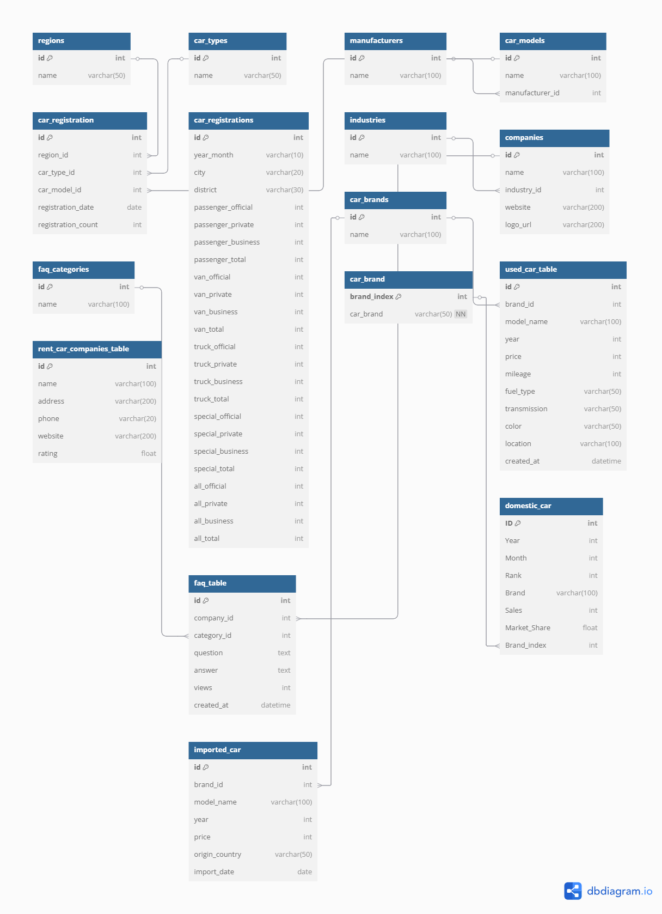

---

## 📋 테이블 명세
| 테이블명                 | 설명                                   | 컬럼명                                                                                                    |
|------------------------|--------------------------------------|--------------------------------------------------------------------------------------------------------|
| `used_car_table`        | 중고차 정보                            | `id`(INT, PK, AI), `car_name`(VARCHAR(100)), `car_year`(INT), `car_km`(INT), `car_price`(INT), `car_cate`(VARCHAR(100)), `car_brand`(VARCHAR(100)), `brand_num`(INT, FK) |
| `car_brands`            | 자동차 브랜드                           | `brand_num`(INT, PK, AI), `car_brand`(VARCHAR(50))                                                       |
| `products`              | 상품 정보                              | `id`(INT, PK, AI), `name`(VARCHAR(100)), `price`(INT), `stock`(INT)                                       |
| `domestic_car_table`    | 국산차 브랜드별 등록정보                  | `id`(INT, PK, AI), `Year`(INT), `Month`(INT), `Rank`(INT), `Brand`(VARCHAR(100)), `Sales`(INT), `Market_Share`(FLOAT), `Brand_index`(INT, FK) |
| `imported_car_table`   | 외제차 브랜드별 등록정보                 | `id`(INT, PK, AI), `year`(INT), `month`(INT), `brand`(VARCHAR(100)), `sales`(INT), `ratio`(FLOAT), `brand_index`(INT, FK) |
| `car_company_table`     | 자동차 제조사 정보                       | `id`(INT, PK, AI), `name`(VARCHAR(50))                                                                   |
| `car_models`            | 자동차 모델 정보                        | `id`(INT, PK, AI), `name`(VARCHAR(100)), `manufacturer_id`(INT), `car_type_id`(INT), `year`(INT), `description`(TEXT), `created_at`(TIMESTAMP), `updated_at`(TIMESTAMP) |
| `car_registration`      | 자동차 등록 정보                         | `id`(INT, PK, AI), `registration_date`(DATE), `region_id`(INT), `car_type_id`(INT), `car_model_id`(INT), `registration_count`(INT), `created_at`(TIMESTAMP), `updated_at`(TIMESTAMP) |
| `car_registrations`     | 자동차 월별 등록 통계                     | `id`(INT, PK, AI), `year_month`(VARCHAR(10)), `city`(VARCHAR(20)), `district`(VARCHAR(30)), `passenger_official`(INT), `passenger_private`(INT), `passenger_business`(INT), `passenger_total`(INT), `van_official`(INT), `van_private`(INT), `van_business`(INT), `van_total`(INT), `truck_official`(INT), `truck_private`(INT), `truck_business`(INT), `truck_total`(INT), `special_official`(INT), `special_private`(INT), `special_business`(INT), `special_total`(INT), `all_official`(INT), `all_private`(INT), `all_business`(INT), `all_total`(INT) |
| `car_types`             | 자동차 종류 정보                        | `id`(INT, PK, AI), `name`(VARCHAR(50)), `description`(TEXT), `created_at`(TIMESTAMP), `updated_at`(TIMESTAMP) |
| `faq_table`             | 자동차 관련 FAQ 정보                     | `id`(INT, PK, AI), `car_company_id`(INT), `question`(TEXT), `answer`(TEXT)                              |
| `imported_car`          | 외제차 브랜드별 판매 통계                 | `id`(INT, PK, AI), `year`(INT), `month`(INT), `brand`(VARCHAR(100)), `sales`(INT), `ratio`(FLOAT), `brand_index`(INT, FK) |
| `manufacturers`         | 자동차 제조사 정보                       | `id`(INT, PK, AI), `name`(VARCHAR(100)), `country`(VARCHAR(50)), `description`(TEXT), `created_at`(TIMESTAMP), `updated_at`(TIMESTAMP) |
| `regions`               | 지역 정보                               | `id`(INT, PK, AI), `name`(VARCHAR(50)), `code`(VARCHAR(10)), `description`(TEXT), `created_at`(TIMESTAMP), `updated_at`(TIMESTAMP) |
| `regions_table`         | 지역 테이블                             | `id`(INT, PK, AI), `region_name`(VARCHAR(255))                                                           |
| `rent_car_companies_table` | 렌터카 회사 정보                         | `id`(INT, PK, AI), `company_name`(VARCHAR(255)), `region_id`(INT), `sedan_vehicle_count`(INT), `van_vehicle_count`(INT), `electric_sedan_vehicle_count`(INT), `electric_van_vehicle_count`(INT) |

---

## 🌀 DFD (Data Flow Diagram)

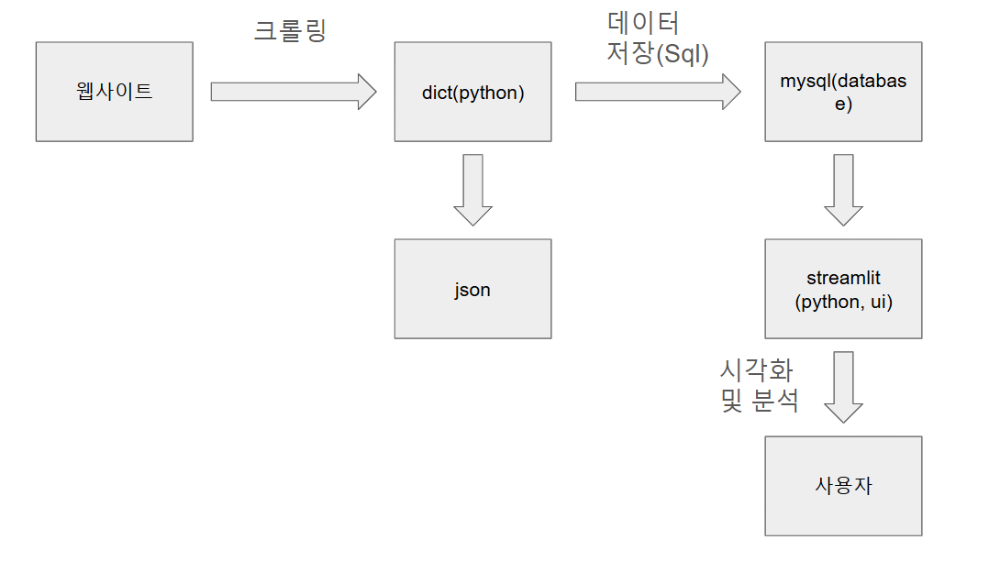

---

## 🖼 시연 이미지
> 프로젝트의 주요 기능을 보여주는 이미지를 추가하세요.  
> 예를 들어 `docs/demo1.png`, `docs/demo2.png` 등의 파일을 업로드하고 아래와 같이 표시할 수 있습니다.

  
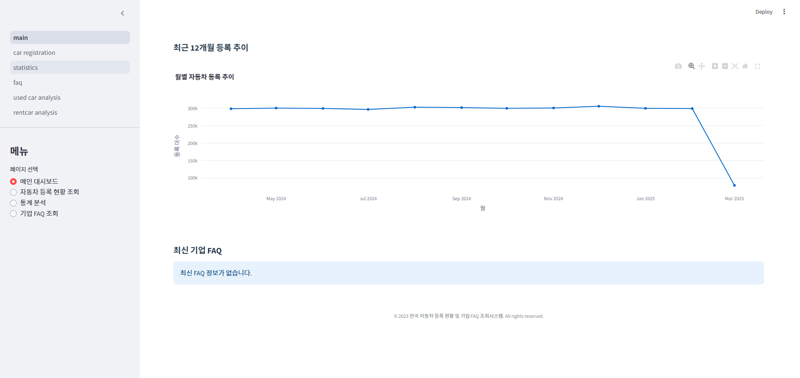 
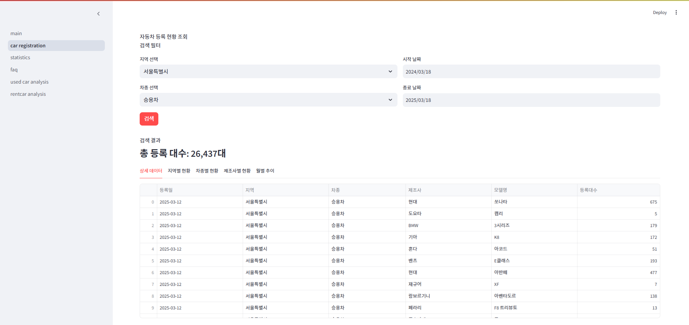 
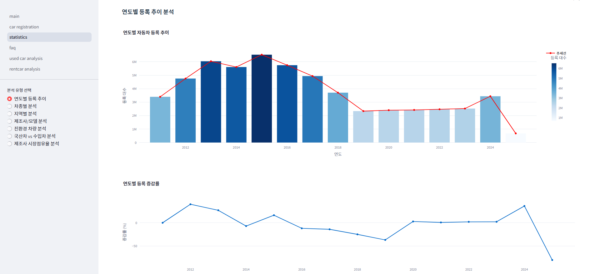 
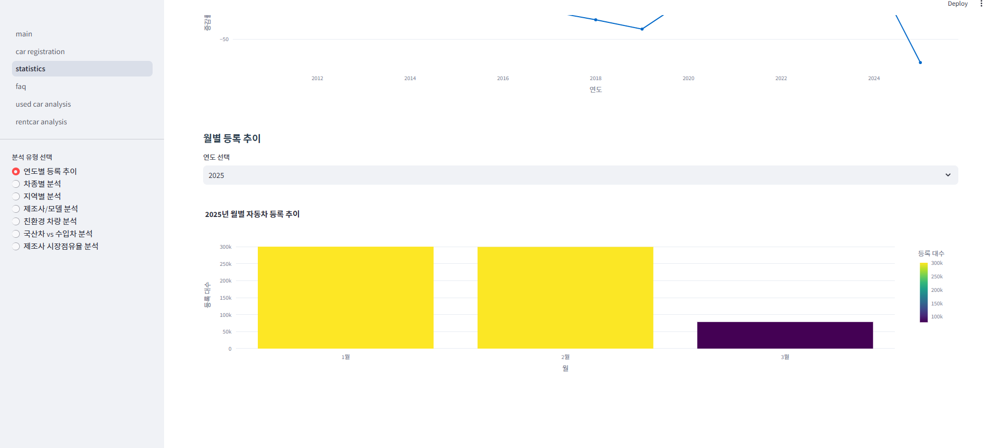 
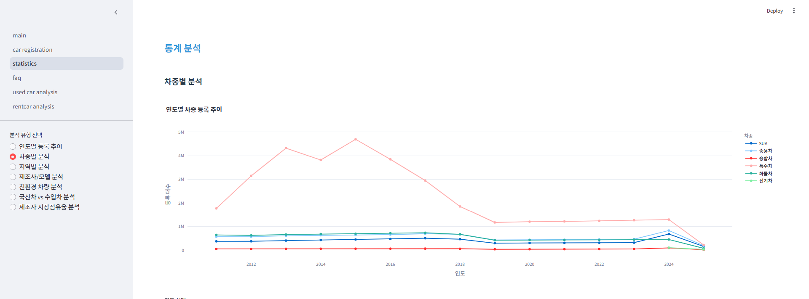 
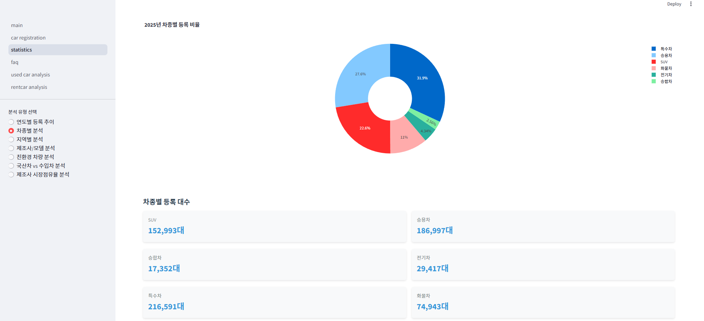 
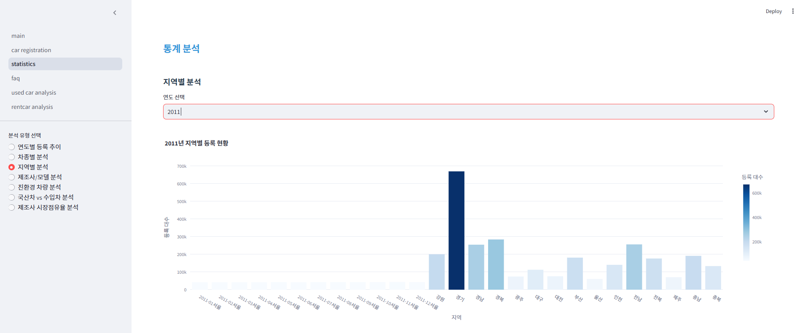 
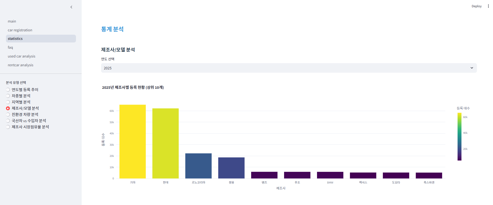 
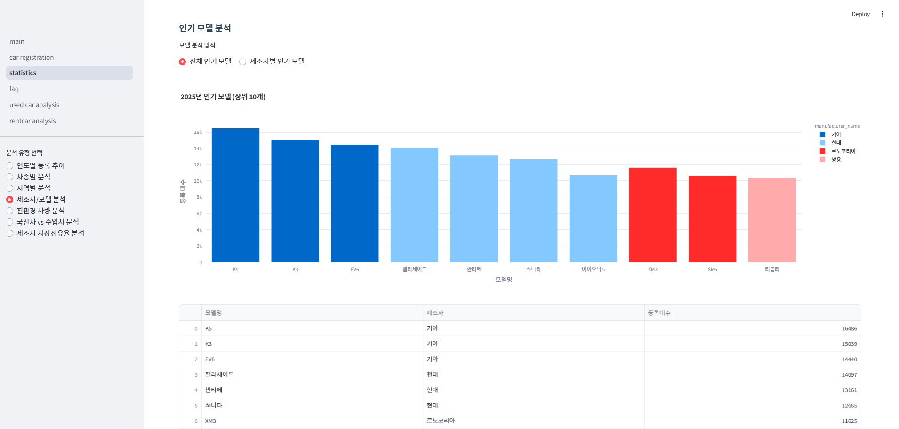 
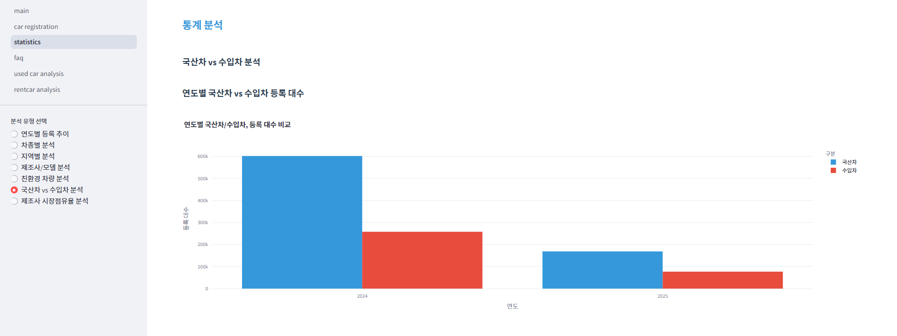 
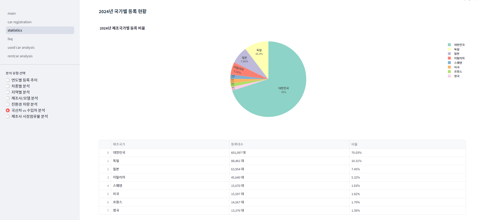 
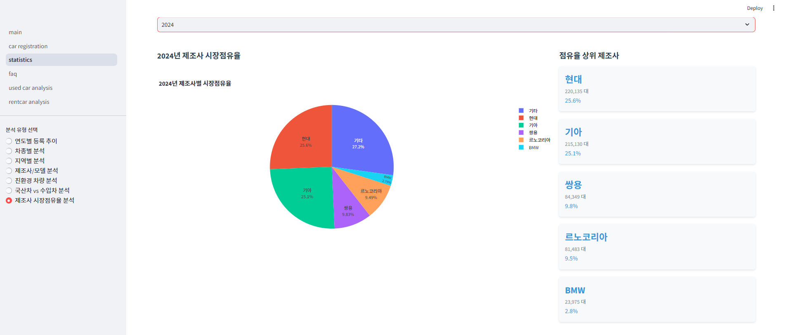 
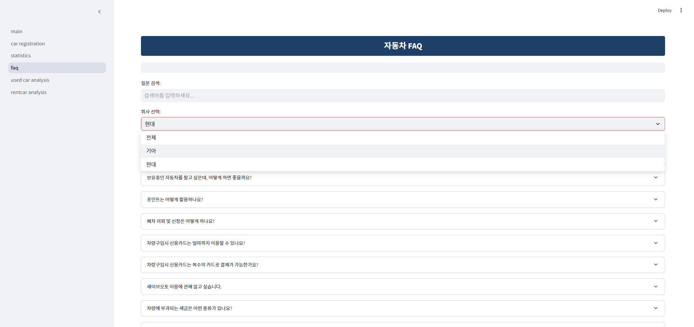 
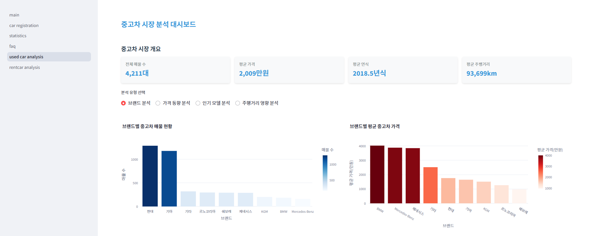 
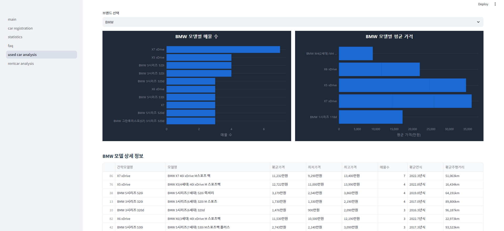 
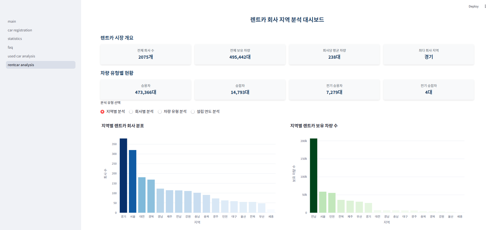 
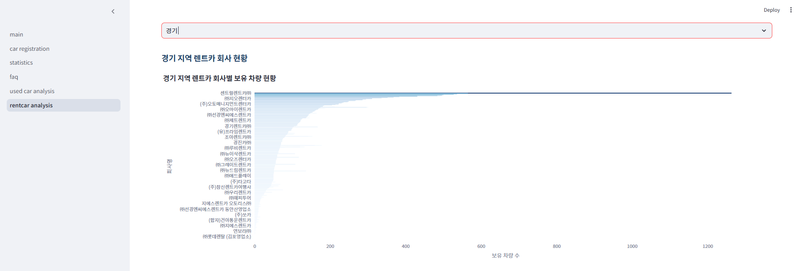 
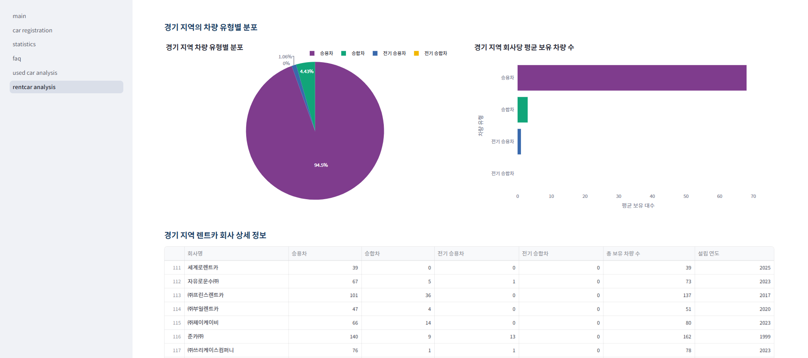 

---

## 💭 한줄 회고
회고록작성하주세요.
- **권성호:** "처음에는 많이 버벅이고 힘들었지만 완성하고 나니 너무 뿌듯하고 보람찼습니다. 이번 프로젝트를 시작으로 이후 프로젝트도 성공적으로 완수하도록 노력하겠습니다."
- **노명구:** "첫프로젝트라 걱정이 많았지만, 팀원모두가 열심히 맡은바를 다하여 좋은 결과물을 얻을 수 있었던 것 같습니다!"
- **이준배:** "한명도 빠짐 없이 모두가 열심히 하여 완성 할 수 있었던것 같습니다. 앞으로도 조금씩 발전해가며 더욱 나은 프로젝트를 해보고싶습니다"
- **최요섭:** "첫 프로젝트라 잘 할 수 있을까 걱정이 되었는데 팀원분들이 도와주셔서 잘 마무리 할 수 있었던것 같습니다. 다음 프로젝트때는 도움을 줄 수있도록 더 열심히 노력하겠습니다."
- **황차해:** "처음 하는 프로젝트라 어렵게 느껴졌지만 팀원들의 많은 도움이있어서 해낼 수 있었습니다.  대용량 데이터처리의 시간이 많이 걸려서 개인적으로 공부를 더 해야할 것 같습니다."
